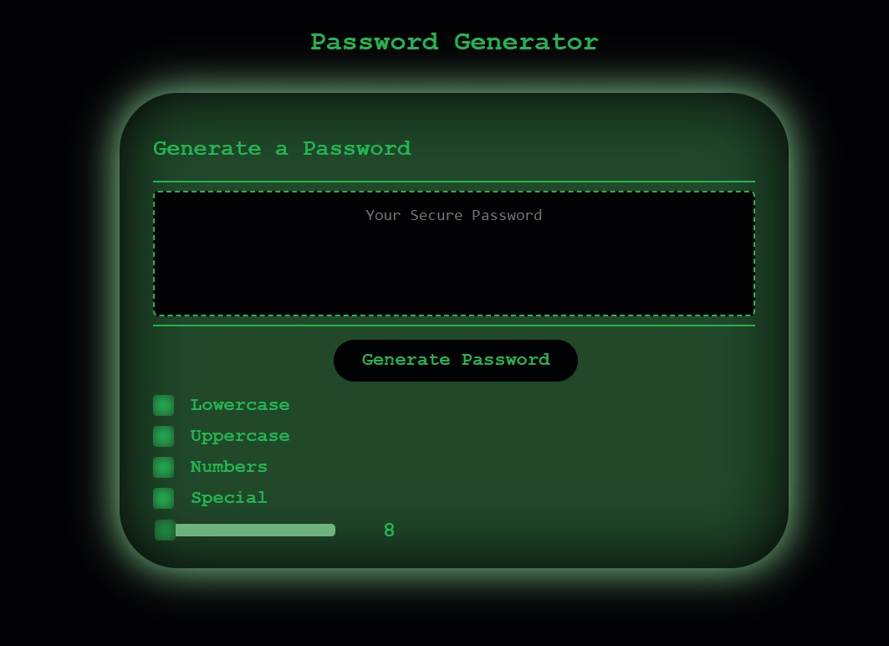

# password-generator

[This password generator](https://elrond-hubbard.github.io/password-generator/) can output a random password based on  
options selected by the user. The password can contain letters,  
numbers, and special characters. It can contain up to 128 characters.  

## How To Use

To select which characters you would like to include,  
click the buttons for each character type.  
All character types are selected by default.
To define the length of the password,  
use the slider.

## Credits

Custom checkbox and slider CSS sourced from W3 Schools
https://www.w3schools.com/howto/howto_css_custom_checkbox.asp